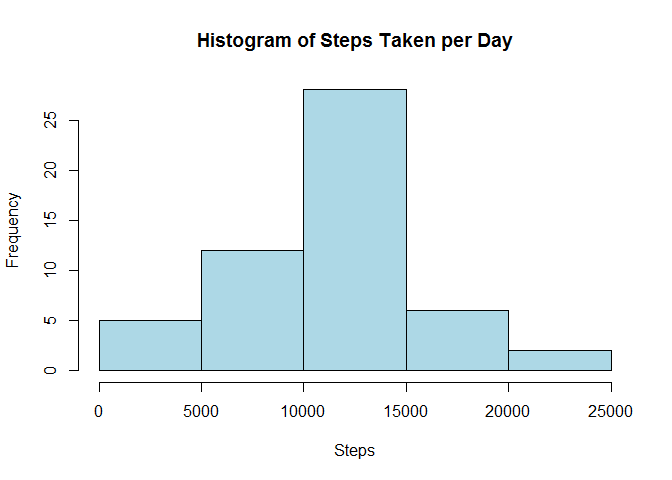
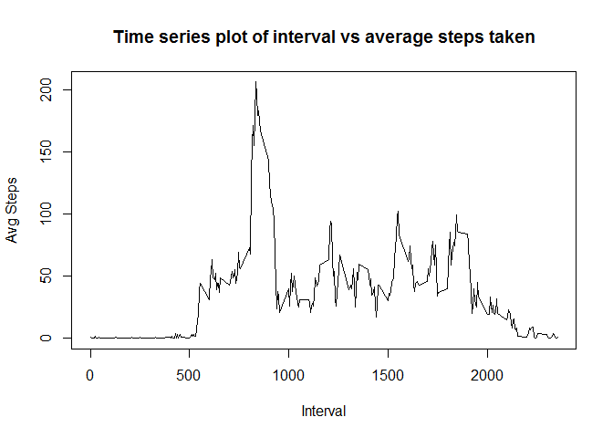
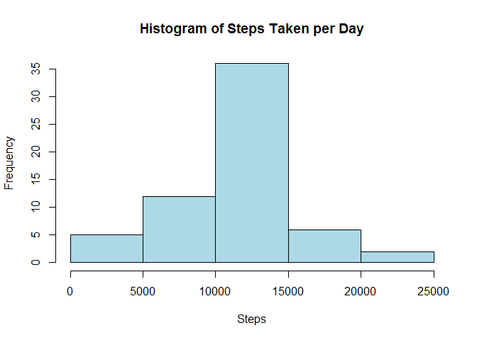

# Reproducible Research: Peer Assessment 1

## Loading and preprocessing the data

First, load the raw data and the libraries used for processing the data.


```r
library(sqldf)
```

```
## Loading required package: gsubfn
## Loading required package: proto
## Loading required package: RSQLite
## Loading required package: DBI
```

```r
activity <- read.csv("activity.csv")
```
## What is mean total number of steps taken per day?


```r
sum_steps <- sqldf("select sum(steps) as steps, date 
                   from activity 
                   group by date 
                   order by date")
```

```
## Loading required package: tcltk
```

#### 1. Make a histogram of the total number of steps taken each day


```r
hist(sum_steps$steps, main = "Histogram of Steps Taken per Day", xlab = "Steps", col = "lightblue")
```

 

#### 2. Calculate and report the mean and median total number of steps taken per day


```r
mean_steps <- as.integer(sqldf("select avg(steps) from sum_steps"))
median_steps <- median(sum_steps$steps, na.rm = TRUE)
```

The mean total number of steps taken per day is 10766.  
The median total number of steps taken per day is 10765.

## What is the average daily activity pattern?

#### 1. Make a time series plot (i.e. type = "l") of the 5-minute interval (x-axis) and the average number of steps taken, averaged across all days (y-axis)


```r
avg_daily_act <- sqldf("select avg(steps) as steps, interval 
                       from activity 
                       group by interval 
                       order by interval")
plot(avg_daily_act$interval, avg_daily_act$steps, type = "l", 
     main = "Time series plot of interval vs average steps taken", 
     xlab = "Interval", ylab = "Avg Steps")
```

 

#### 2. Which 5-minute interval, on average across all the days in the dataset, contains the maximum number of steps?


```r
max_steps <- as.integer(sqldf("select interval from avg_daily_act 
                              where steps = (select max(steps) from avg_daily_act)"))
```

Interval 835 has the most number of steps averaged across all the days in the dataset.

## Imputing missing values

#### 1. Calculate and report the total number of missing values in the dataset (i.e. the total number of rows with NAs)


```r
missing_values <- sum(is.na(activity$steps))
```

There are 2304 missing values in the raw data.

#### 2. Devise a strategy for filling in all of the missing values in the dataset. The strategy does not need to be sophisticated. For example, you could use the mean/median for that day, or the mean for that 5-minute interval, etc.

The missing values will be replaced by the average steps for that 5-minute interval.

#### 3. Create a new dataset that is equal to the original dataset but with the missing data filled in.


```r
filled_activity <- merge(activity, avg_daily_act, by.x = "interval", by.y = "interval", all.x = TRUE, sort = FALSE)
names(filled_activity)[2] <- "steps"
names(filled_activity)[4] <- "avg_steps"
filled_activity <- sqldf(c('update filled_activity set steps = avg_steps where steps IS NULL', 'select * from main.filled_activity'))
```

#### 4. Make a histogram of the total number of steps taken each day and Calculate and report the mean and median total number of steps taken per day. Do these values differ from the estimates from the first part of the assignment? What is the impact of imputing missing data on the estimates of the total daily number of steps?


```r
sum_steps <- sqldf("select sum(steps) as steps, date 
                   from filled_activity 
                   group by date 
                   order by date")
hist(sum_steps$steps, main = "Histogram of Steps Taken per Day", xlab = "Steps", col = "lightblue")
```

 

```r
new_mean_steps <- as.integer(sqldf("select avg(steps) from sum_steps"))
new_median_steps <- median(sum_steps$steps, na.rm = TRUE)
diff_mean_steps <- mean_steps - new_mean_steps
diff_median_steps <- median_steps - new_median_steps
```

The new mean total number of steps taken per day is 10766.  
The new median total number of steps taken per day is 10765.  
Filling in missing data using this method **has** changed the mean and median step values.  
There are 17 fewer mean steps and 124 fewer median steps.

## Are there differences in activity patterns between weekdays and weekends?
